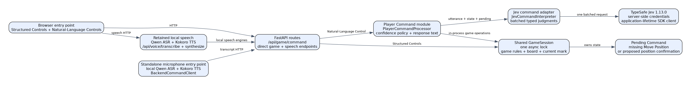

# Voice tic-tac-toe

Play a shared-turn game through browser buttons, typed Player Commands, or a standalone microphone client. Accepted moves alternate X and O. There is no automated opponent.

TypeSafe Jev interprets Natural-Language Controls. The command module owns confidence policy, Pending Commands, and response text. A shared `GameSession` owns game rules and state. Structured Controls bypass interpretation. Qwen ASR and Kokoro TTS run locally.

## Set up the server

Run all commands from the repository root. Install Python 3.12 or later, `uv`, Node.js for browser controller tests, and system audio support. Linux microphone playback needs PortAudio, and Kokoro pronunciation needs `espeak-ng`.

```bash
uv venv
uv pip install -r requirements.txt
uv run python scripts/check_dev_environment.py
```

This repository uses `requirements.txt`, not a project manifest. `transformers==4.57.6` is pinned for the retained ASR integration. Install the model download CLI into the same environment.

```bash
uv pip install huggingface-hub
uv run ./download_models.sh
```

The downloader fetches `Qwen/Qwen3-ASR-0.6B` into `models/Qwen3-ASR-0.6B`, checks its `config.json` and nonempty safetensors weights, and downloads the nonempty Kokoro model and voices files. Speech assets remain ignored by Git.

For Natural-Language Controls, set `TYPESAFE_API_KEY` only on the server. Keep credentials out of browser code, screenshots, logs, and commits. A repository `.env` can contain your private credential and `TYPESAFE_DEFAULT_MODEL=jev-1.13.0`. The production adapter defaults to this validated model if the model variable is absent. An explicit model override changes the calibrated deployment.

`voice_game.sh` inherits exported shell variables. It does not load `.env` itself. To load `.env` with `uv`, start it as follows.

```bash
uv run --env-file .env ./voice_game.sh start
```

Without a credential, start with `./voice_game.sh start`. Structured Controls remain available. Natural-Language Controls return a configuration error.

## Play in the browser

Open `http://localhost:8002`. **New Game**, board cells, and **Quit** are Structured Controls. Typed text and browser speech transcripts use `POST /api/game/command`.

Browser voice input uses the browser's speech recognition when available and falls back to local ASR through `POST /api/voice/transcribe`. Speech output uses local Kokoro through `POST /api/voice/synthesize`. Browser microphone support and permission depend on the browser and a secure context, including localhost.

Try "start a game", "place a mark", and "center" to complete a Pending Command. The server returns a domain command result with intent, position, confidence, clarification status, response text, and game state.

## Play through the standalone client

Start the backend first. In another terminal, run one of these commands.

```bash
uv run python voice_tic_tac_toe.py
uv run python voice_tic_tac_toe.py --simulation
```

Microphone mode records audio between Enter presses, transcribes through local Qwen ASR, sends the transcript through `BackendCommandClient` to the same command endpoint, and speaks the response through local Kokoro. Simulation mode accepts typed transcripts and retains TTS. The client does not own an interpretation service or a separate game. Use `--help` for speech model and device overrides.

## Operate the backend

```bash
./voice_game.sh status
./voice_game.sh restart
./voice_game.sh stop
```

The script manages one backend process using `.backend.pid`. `status` checks process liveness, not HTTP readiness. `start` waits for `/api/health` before reporting success, and `restart` waits for shutdown before launching the replacement. Startup and shutdown have a 30-second limit. A failed startup returns a nonzero exit code and points to `logs/backend.log`. An occupied port without a live tracked process also fails. The script leaves that server running; identify and stop it before retrying. Run commands from the root because configuration and model paths are relative to the working directory.

`config/backend.conf` supplies the startup port, API title, and version. Startup binds `0.0.0.0`. `config/voice.conf` supplies speech paths, TTS enablement, voice settings, and the standalone backend URL. Keep its `api_gateway.base_url` aligned with the backend port. Some fields are reference settings rather than active options. The server ignores the configured host, and TTS returns its actual synthesis sample rate.

```bash
curl --fail http://localhost:8002/api/health
curl --fail http://localhost:8002/api/health/typesafe
curl --fail http://localhost:8002/api/health/asr
curl --fail http://localhost:8002/api/health/tts
curl --fail http://localhost:8002/api/health/gpu
tail -n 50 logs/backend.log
```

TypeSafe health is passive. It reports configuration and cached command outcomes as `unconfigured`, `unverified`, `healthy`, `degraded`, or `unavailable`, without provider usage. ASR and TTS health can load local models. A successful HTTP health response can contain a degraded or unavailable speech status. GPU health reports availability rather than verifying inference. Command logs contain identifiers and metadata rather than utterances or credentials.

## Verify the architecture

```bash
uv run pytest -q test/test_player_command.py test/test_jev_command_interpreter.py
uv run pytest -q test/test_repository_standards.py
uv run pytest -q
uv run python scripts/audit_hard_cutover.py --root "$PWD"
uv run --env-file .env python scripts/evaluate_jev_fixtures.py
```

The full deterministic suite uses fake interpretation and speech boundaries. It includes the Node.js browser controller smoke and standalone HTTP adapter tests. These verify contracts, not provider access, microphone hardware, or real speech inference. The fixture evaluator requires credentials and network access, reports sanitized aggregate results, and skips explicitly without a credential.

For final live verification, drive the running browser through a Structured Control game and a Natural-Language Control game. Check a missing Move Position and its follow-up, and confirm TypeSafe health changes after successful commands. Run standalone simulation against that same backend, then verify microphone input and audible TTS on a machine with audio devices. Record hardware and service limitations separately. See the [acceptance matrix](docs/acceptance-test-matrix.md) and [dated verification evidence](docs/cutover-verification.md).

## Troubleshoot failures

- If startup reports a running process but HTTP fails, inspect `logs/backend.log` and check the configured port. Stop and start after fixing dependencies or configuration.
- If Natural-Language Controls fail, check credential availability in the backend environment and passive TypeSafe health. Restart after changing environment variables. Missing credentials return 503, rejected credentials return 401, rate limits return 429, overload returns 503, transport failures return 502, and timeouts return 504. Structured Controls remain usable.
- If commands clarify instead of moving, supply the missing Move Position or confirm the proposed position. Application code validates occupied cells and enforces the confidence policy.
- If speech health is degraded, verify the downloaded assets and declared dependencies. ASR needs model configuration and weights. TTS needs both the model and voices file, pronunciation support, and `enabled = true`.
- If standalone simulation cannot speak, check local audio output. Simulation skips the microphone and ASR, but still loads TTS unless disabled in `config/voice.conf`.
- If the browser microphone fails, check permission and speech recognition support. Typed commands and Structured Controls provide alternate input.

The [architecture explanation](docs/jev-migration-plan.md) describes module ownership. The editable [diagram](architecture.drawio) and its rendered image show both entry points.



### Jev exchange debugging

Set `JEV_DEBUG=true` in the backend environment and restart the server to enable
request and response capture. Open **Debug** on either game page to inspect
Natural-Language Controls. Capture continues while the panel is closed. The
setting defaults to disabled; command responses then keep their existing domain
fields. Structured Controls do not call Jev or create exchanges. Credentials and
transport headers are excluded from diagnostic data.

To create an exchange, type a command such as `start a game` and choose **Send**
or press Enter, or use a spoken command. **Start Game**, board cells, and position
buttons apply game actions directly and leave Jev history empty. **TYPESAFE:
UNVERIFIED** means the provider is configured but has not handled a Jev request
yet. After a successful request, the badge updates on its next health poll.

From the repository root, run this command to enable capture for the restarted
backend while loading other settings from `.env`:

```bash
JEV_DEBUG=true uv run --env-file .env ./voice_game.sh restart
curl --fail http://localhost:8002/api/debug/jev
```

The capability response must report `"enabled": true`. Refresh the game page
after the restart. To keep capture enabled across later restarts, add
`JEV_DEBUG=true` to `.env` and load it with
`uv run --env-file .env ./voice_game.sh restart`. The script inherits its caller's
environment and does not load `.env` itself.

The Debug panel keeps the latest 50 exchanges in this tab's memory, including
commands submitted while it is closed. New games preserve history. Refreshing
starts fresh, and **Clear history** removes entries and selection immediately,
including pending requests whose later responses cannot restore them. New entries
preserve the inspected exchange. Click the new-exchange indicator to inspect the
latest entry. If retention removes the inspected exchange, the panel asks you to
select a retained entry.

At widths of 1400 pixels or more, the panel sits beside the game. Use **Panel
width** to adjust it between 400 and 700 pixels. At smaller widths it sits below
the game, with separate scrolling for history and details. Each tab captures only commands submitted from that tab. Each tab has its own
history while all tabs connected to one backend share the game and Pending
Command state. History is neither persisted nor synchronized across tabs.
